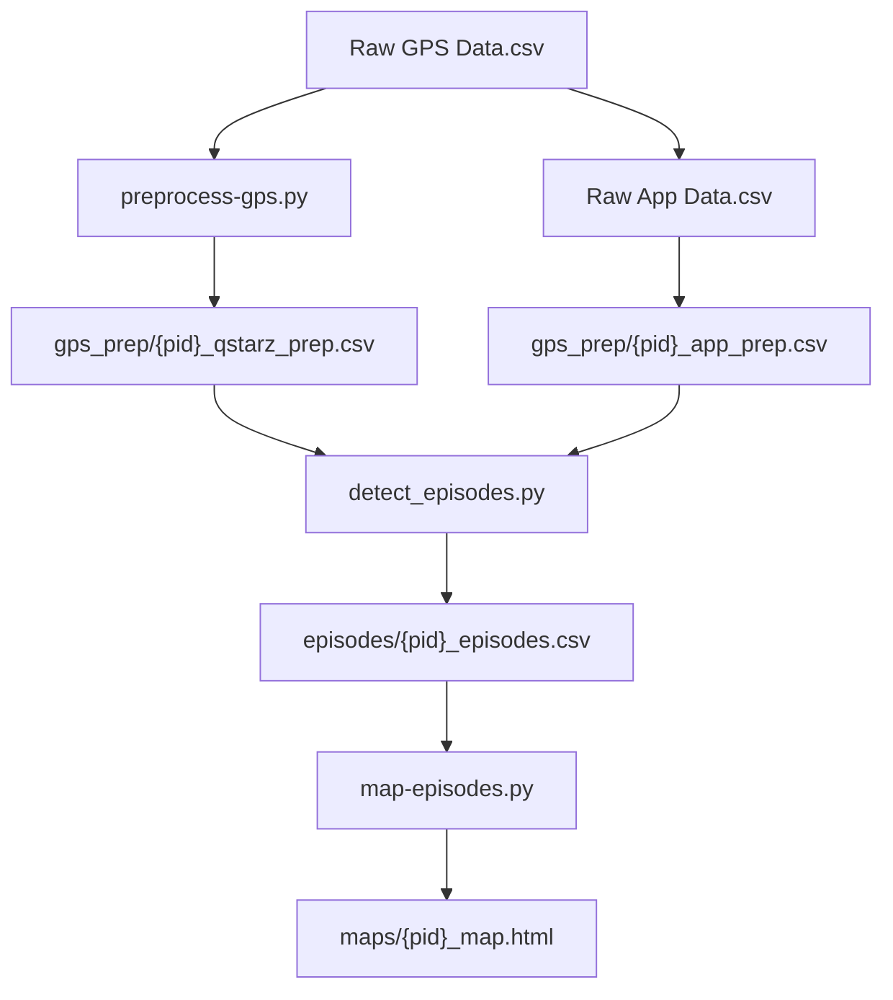

# SURREAL Episode Processing Pipeline

## Folder Structure
```
SURREAL/
├── data/
│   ├── raw/
│   │   └── Participants/
│   │       └── P*/9 - Smartphone Tracking App/*.csv
│   ├── processed/
│   │   ├── gps_prep/  # Preprocessed GPS data
│   │   ├── episodes/  # Detected behavioral episodes
│   │   └── maps/      # Visualization outputs
├── config/
│   └── paths.py       # Centralized path configuration
└── episode-preprocessing/
    ├── preprocess-gps.py
    ├── detect_episodes.py
    ├── map-episodes.py
    └── README.md
```

## Workflow



## Preprocessing Pipeline

1. **Geospatial Preprocessing** (`preprocess-gps.py`):
   - Processes GPS data from Qstarz devices and smartphone sensors
   - Outputs: `gps_prep/{pid}_qstarz_prep.csv`, `gps_prep/{pid}_app_prep.csv`

2. **Episode Detection** (`detect_episodes.py`):
   - Uses preprocessed GPS and digital data to detect behavioral episodes
   - Outputs: `episodes/{pid}_episodes.csv`

3. **Visualization** (`map-episodes.py`):
   - Generates interactive maps of detected episodes
   - Outputs: `maps/{pid}_episodes.html`